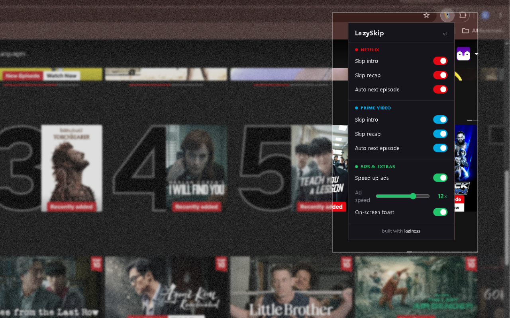

# LazySkip

**Sit back. It skips the boring parts for you.**

Auto-skips intros & recaps, auto-plays the next episode, and speeds through ads
on **Netflix** and **Amazon Prime Video** — so you never touch the remote.

---

## ✨ Features

| | Netflix | Prime Video |
|---|:---:|:---:|
| Skip intro | ✅ | ✅ |
| Skip recap | ✅ | ✅ |
| Auto next episode | ✅ | ✅ |
| Speed up ads (up to 16×) | ✅ | ✅ |

- 🎛️ Toggle anything from the popup, tune the ad speed with a slider.
- 🔴🔵 Brand-coloured UI + a tiny on-screen toast when it acts.
- 🔒 **Zero data collection.** Only permission used is `storage`, for your own settings. Nothing leaves your browser.

## 🚀 Install (Load unpacked)

1. Download or clone this repo.
2. Open `chrome://extensions` and turn on **Developer mode**.
3. Click **Load unpacked** and select the `LazySkip` folder.
4. Open Netflix or Prime Video and relax.

## 🛠️ How it works

A small content script watches the player and clicks the right buttons the moment
they appear — using each service's stable hooks, with text fallbacks for Prime's
obfuscated markup. No tracking, no network calls, no nonsense.

---

built with <b>laziness</b> 😴

