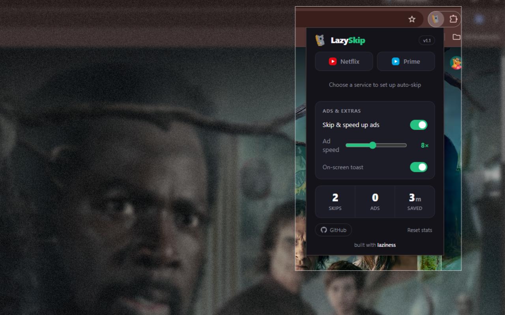
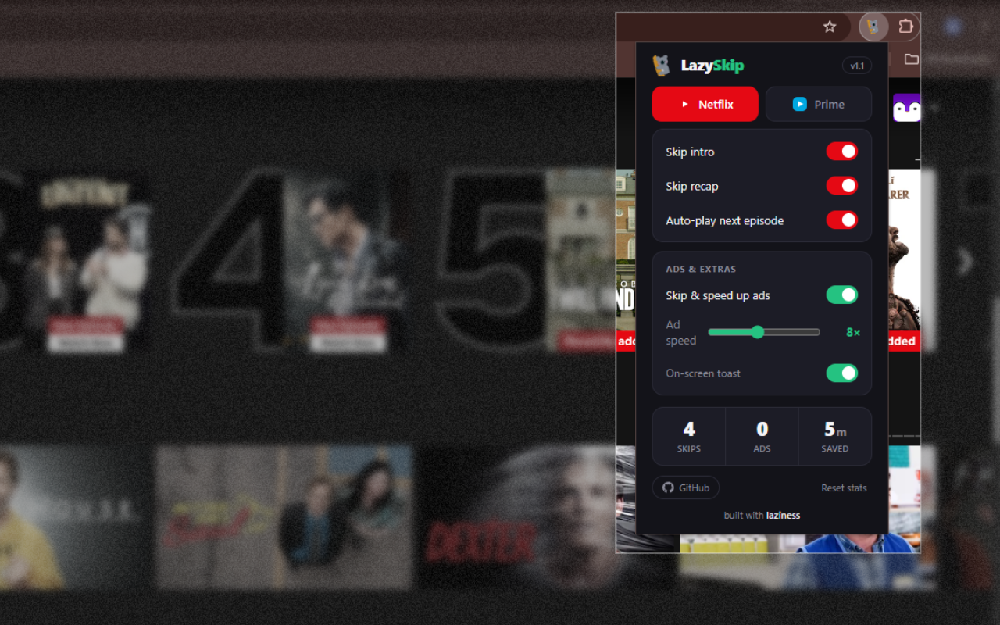

# LazySkip

**Sit back. It skips the boring parts for you.**

Auto-skips intros & recaps, auto-plays the next episode, and gets you past ads
— **skips** them on Prime Video, **fast-forwards** them on Netflix — so you
never touch the remote.

  

&nbsp;

---

## ✨ Features

| | Netflix | Prime Video |
|---|:---:|:---:|
| Skip intro | ✅ | ✅ |
| Skip recap | ✅ | ✅ |
| Auto next episode | ✅ | ✅ |
| Get past ads | ⏩ fast-forward (up to 16×) | ⏭️ skips/fast-forward (up to 16×) |

> On **Prime Video**, LazySkip seeks past ads using Prime's own countdown.
> On **Netflix** (ad tier), it fast-forwards through them at your chosen speed.

- 🎛️ Toggle anything from the popup, tune the ad speed with a slider.
- 🔴🔵 Brand-coloured UI + a tiny on-screen toast when it acts.
- 🔒 **Zero data collection.** Only permission used is `storage`, for your own settings. Nothing leaves your browser.

## 🚀 Install

**[➜ Install from the Chrome Web Store](https://chromewebstore.google.com/detail/lazyskip/ilaeamkehaknfolckfppekhiokfogjmj)** — one click, auto-updates.

Or load it unpacked (for development)

1. Download or clone this repo.
2. Open `chrome://extensions` and turn on **Developer mode**.
3. Click **Load unpacked** and select the `LazySkip` folder.
4. Open Netflix or Prime Video and relax.

## 🛠️ How it works

A small content script watches the player and clicks the right buttons the moment
they appear — using each service's stable hooks, with text fallbacks for Prime's
obfuscated markup. No tracking, no network calls, no nonsense.

## 🤝 Contributing

Open source and PRs welcome! Streaming sites change their markup often — if a
button stops being caught, open an [issue](https://github.com/diwasupadhyay/LazySkip/issues)
with the element's HTML and it's usually a one-line selector fix.

## 📝 Changelog

See [CHANGELOG.md](CHANGELOG.md) for version history.

## 📄 License

[MIT](LICENSE) © diwasupadhyay

---

built with <b>laziness</b> 😴

